# Ex-10-Data-Science-Process-on-Complex-Dataset

## AIM
To Perform Data Science Process on a complex dataset and save the data to a file.

# Explanation
The data science process is a systematic approach to solving a data problem. It provides a structured framework for articulating your problem as a question, deciding how to solve it, and then presenting the solution to stakeholders. 

# ALGORITHM
### STEP 1
Read the given Data.
### STEP 2
Clean the Data Set using Data Cleaning Process.
### STEP 3
Apply Feature Generation/Feature Selection Techniques on the data set.
### STEP 4
Apply EDA /Data visualization techniques to all the features of the data set


# CODE
### Importing necessary packages and loading the dataset.
```python
import pandas as pd
import seaborn as sns
import matplotlib.pyplot as plt
df = pd.read_csv("ds_salaries.csv")
df
```
### Checking for null values.
```python
df.isnull().sum()
```

### Checking for outliers.
```python
plt.figure(figsize=(7,7))
plt.title("Data with outliers")
df.boxplot()
plt.show()
```
### Removal of outliers.
```python
cols=['work_year','salary','salary_in_usd','remote_ratio']
q1=df.quantile(0.75)
q3=df.quantile(0.25)
iqr=q3-q1
low=q1+1.5*iqr
high=q3-1.5*iqr
df=df[(df[cols]>low)&(df[cols]<high)]
df
```
```python
plt.figure(figsize=(7,7))
plt.title("Data without outliers")
df.boxplot()
plt.show()
```
### Data Visualization.
#### Lineplots.
```python
sns.lineplot(x="work_year",y="salary",data=df,marker='o')
plt.title("Work Year vs Salary")
plt.xticks(rotation = 90)
plt.show()
```
```python
sns.lineplot(x="experience_level",y="salary",data=df,marker='o')
plt.title("Experience Level vs Salary")
plt.xticks(rotation = 90)
plt.show()
```
#### KDE plot.
```python
sns.kdeplot(x="experience_level", data = df,hue='salary')
```
```python
sns.kdeplot(x="salary", data = df,hue='remote_ratio')
```
#### Scatterplot.
```python
sns.scatterplot(x="work_year",data=df,y="salary")
```
```python
sns.scatterplot(x="experience_level",data=df,y="salary")
```
```python
```
#### Boxplot.
```python
sns.boxplot(x="experience_level",data=df,y="salary")
```
#### Histogram.
```python
sns.histplot(data = df,x = 'employment_type',hue='company_size')
plt.figure(figsize=(20,7))
```
```python
sns.histplot(data = df,x = 'employment_type',hue='company_size')
plt.figure(figsize=(20,7))
```
#### Violinplot.
```python
sns.violinplot(x="salary",y="salary_in_usd",data=df)
```
```python
sns.violinplot(x="experience_level",y="salary_in_usd",data=df)
```
# OUTPUT
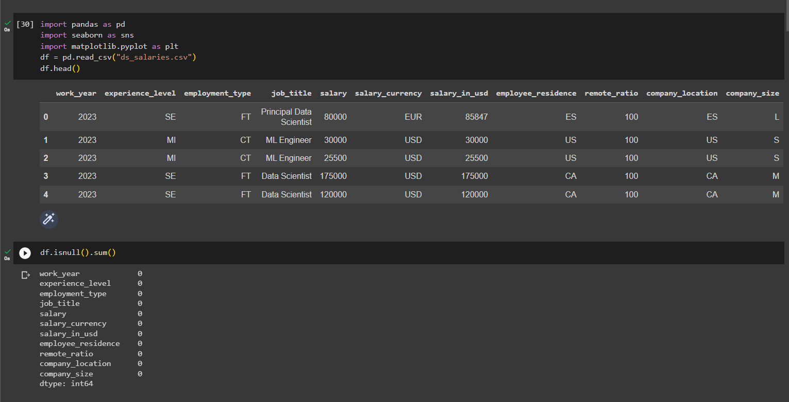
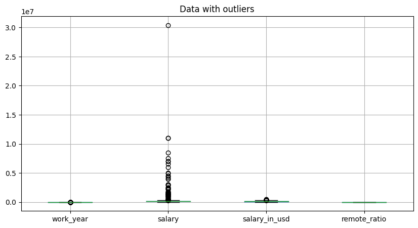
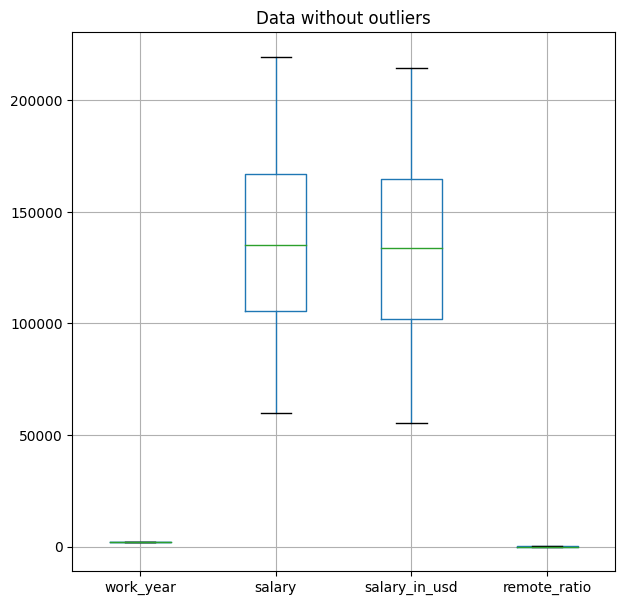
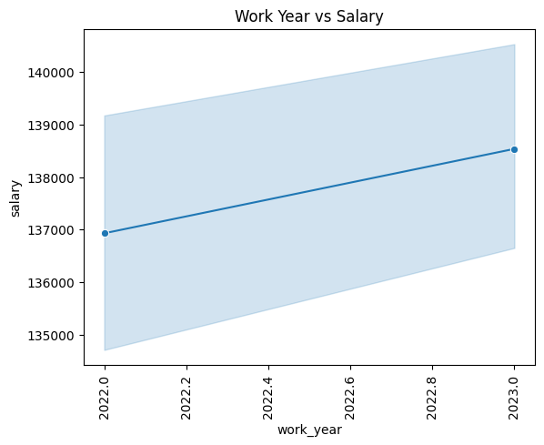
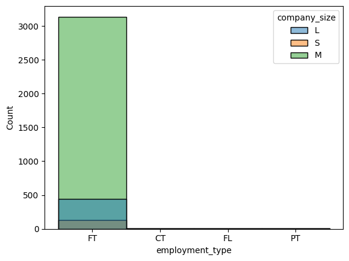
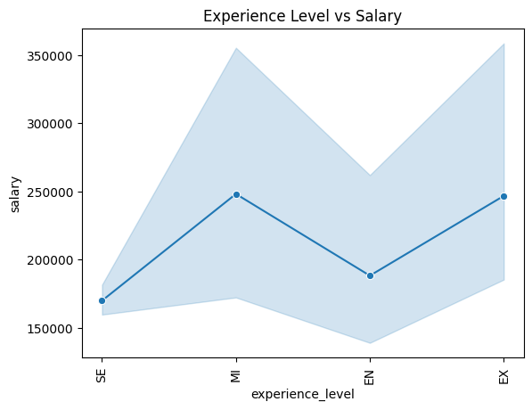
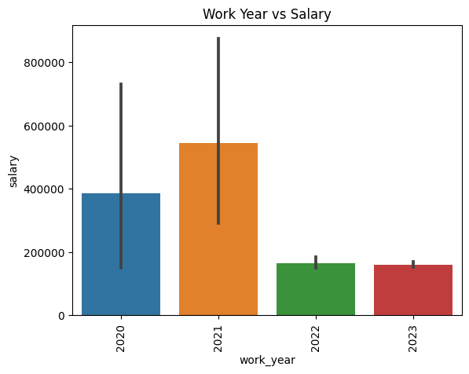
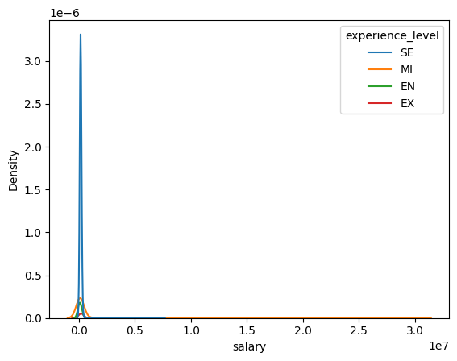
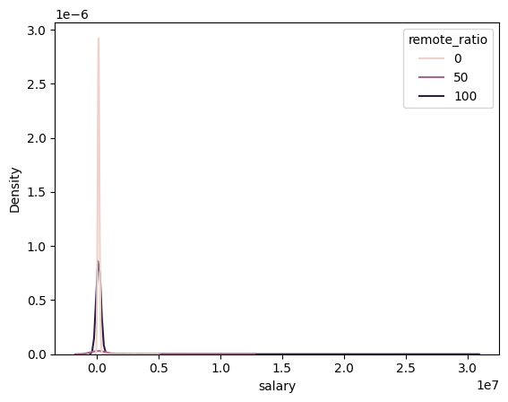
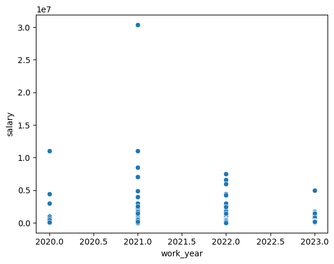
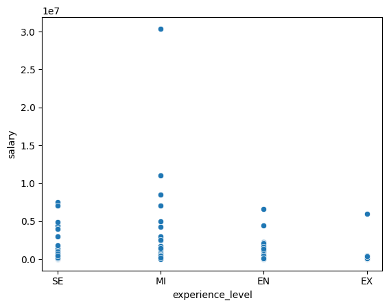
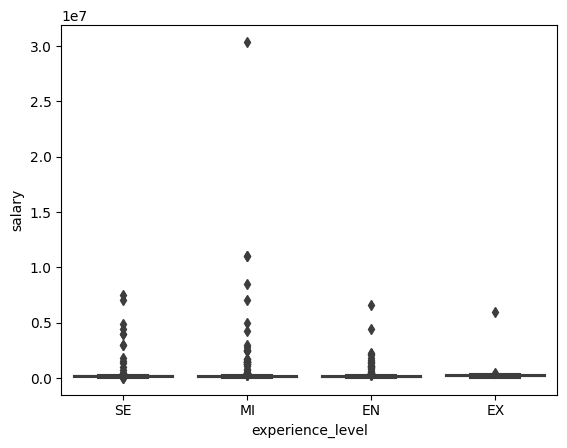
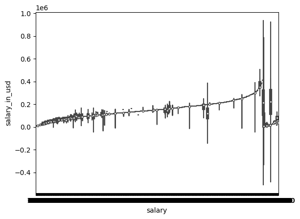
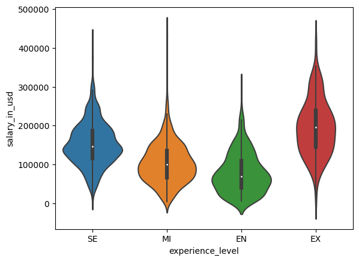
# RESULT

Thus, Data Science Process on a complex dataset and save the data to a file, is successfully performed.